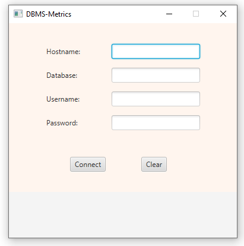
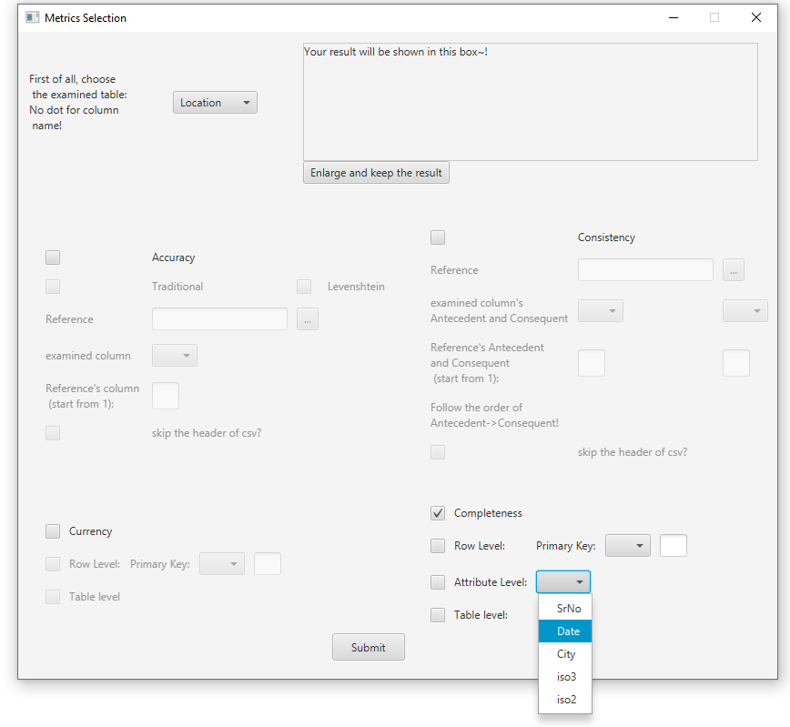
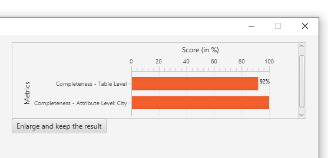
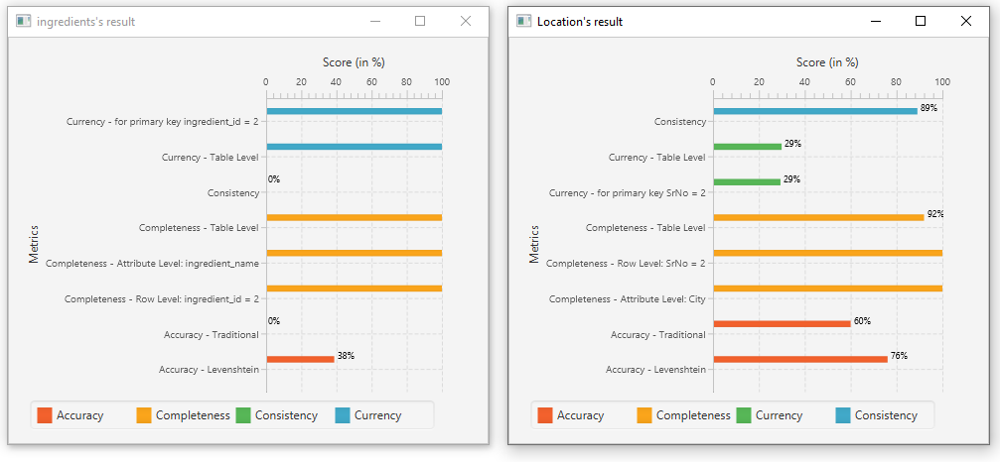

# DBMS-GUI

## The overview of project structure:

- Backend: manipulate the connection and result from Mircosoft SQL Server
  - DataGetter: directly get some general data, eg. table names in the database
  - Metrics: Metric class for each Data Quality Dimensions 
  - ObjectClass: customized object class
  - Reference: decide how to manipulate CSV data
  
- Frontend: handle the interaction between Backend and the users' requests

## Functionality:

The user will start the programm with this page:
 
 
After they have successfully logged in, they will reach the metrics page:

The small window will display the result of the Metrics:
 

It's possible to compare results with the enlarged function
 

## Comments on other components:
- target/Data_Quality_Metrics-1.0.jar is the programm itself
- DBMS-GUI/src/main/java/Main.java provides a "Dummy" Main.class in order to implement JavaFx in jar.File
